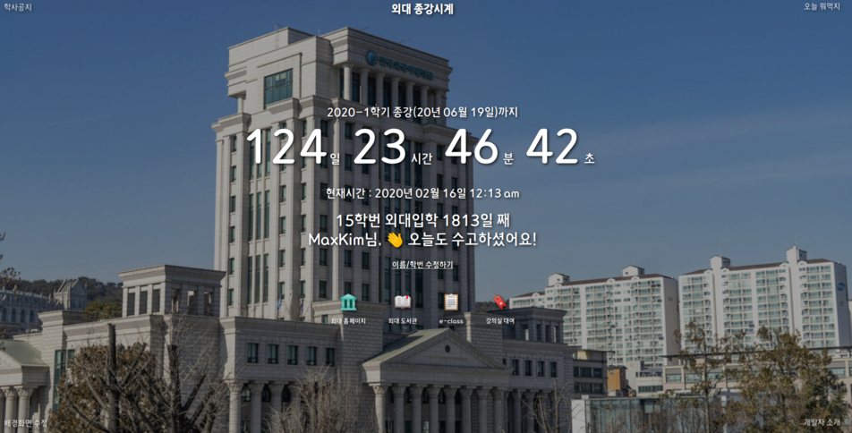
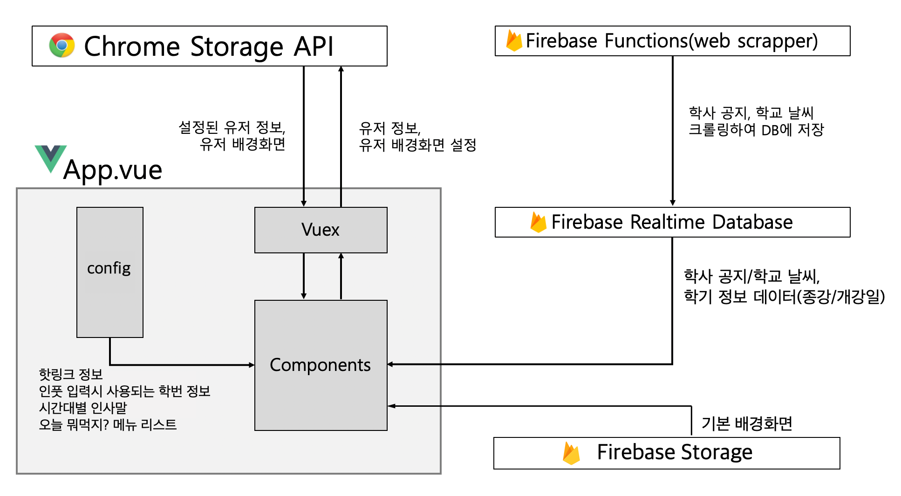

# 외대 종강시계

### 🏛🙏⏱
  
  [](https://github.com/MaxKim-J/HUFS-Semester-Clock-Extension) 


HUFS-Semester-Clock-Extension  
외대생을 위한, 종강까지 얼마나 남았는지 보여주는 크롬 익스텐션

- 🧩 [크롬 웹 스토어에서 다운받기](https://chrome.google.com/webstore/detail/%EC%99%B8%EB%8C%80-%EC%A2%85%EA%B0%95%EC%8B%9C%EA%B3%84/jadlpknbgnmmelikpcaogikohieafaem?hl=ko)

## ✅ 주요 기능

- 새로운 탭을 생성하면 크롬의 디폴트 배경화면 대신, 익스텐션이 제공하는 배경 이미지와 기능이 제공됩니다.
- 학기 중에는 종강까지 남은 시간을 보여줍니다.
- 방학 중에는 계절학기 종강까지 or 다음학기 개강까지 남은 시간을 보여줍니다.
- 학번과 이름을 입력하면 시간에 따른 랜덤 멘트와 입학한 날짜로부터 얼마나 지났는지 볼 수 있습니다.
- 배경화면을 유저가 업로드한 파일을 통해 커스텀 가능합니다.
- 학사 공지 조회와 이문동 날씨 조회와 같은 시계 외의 기능도 존재합니다.

## 🛠 설치

### 개발모드

```shell
git clone https://github.com/MaxKim-J/HUFS-Semester-Clock-Extension.git
cd HUFS-Semester-Clock-Extension
npm install
npm run dev
```

### 배포(dist폴더 만들기)

```shell
npm run build
```

이후 `chrome://extension`으로 이동 후, `압축 해제된 프로젝트 로드` 버튼을 통해 생성된 `dist` 폴더를 로드하면 크롬 브라우저에 익스텐션을 적용할 수 있습니다.

## 📖 Key Note

### 프로젝트 구조/스택



#### Chrome Web Extension with Vue.js

- Vue.js기반 vue-web-extension 크롬 확장앱 보일러플레이트를 사용해서 개발했습니다.
- Vuex를 통해 입력된 유저 관련 정보들에 대한 상태관리를 진행합니다. 유저 관련 정보들은 chrome localstorage에 저장되어 유지됩니다. 
- [Vue.js](https://github.com/vuejs/vue)
- [Vue-web-extension](https://github.com/Kocal/vue-web-extension)
- [Vuex](https://github.com/vuejs/vuex)
- [vue-moment](https://github.com/brockpetrie/vue-moment)

#### Firebase

- Firebase Functions : 학교 홈페이지에서 학사공지, 네이버 날씨 탭에서 외대 주변 날씨 정보를 크롤링하는 웹 스크래퍼를 구현했습니다. Google Cloud Scheduler로 스케쥴링되어 시간 간격을 두고 자동으로 크롤링합니다.
- Firebase Realtime Database : 크롤링한 학사 공지/날씨 정보, 학기별 정보(현재학기, 다음 계절학기, 다음 학기 개강/종강 정보)를 저장합니다.
- Firebase Storage : 학교 모습을 담은 고화질 기본 배경사진 이미지를 저장합니다.
- Firebase 접근에 필요한 변수들은 .env에서 관리합니다(저장소에 커밋되지 않습니다).
- [firebase-js-sdk](https://github.com/firebase/firebase-js-sdk)
- [dotenv](https://github.com/motdotla/dotenv)

#### Test

- 현재 버전(1.4.2)에서는 jest와 vue-test-utils를 사용하여 MainClock 컴포넌트에 테스트 코드를 추가했습니다. 다른 컴포넌트에도 테스트 코드를 추가해 테스트 커버리지를 개선할 예정입니다.
- [jest](https://github.com/facebook/jest)
- [vue-test-utils](https://github.com/vuejs/vue-test-utils)

### 앞으로 하면 좋을 업데이트

- 컴포넌트 테스트 코드 추가, 테스트 커버리지 개선
- 타입스크립트 도입
- 컴포넌트 기능 (좀 더) 세분화
- config 폴더의 앱 내부 데이터를 Firebase DB로 옮겨 앱의 데이터 의존성 개선
- 학식 조회 기능 추가

## 🚩 버전

[릴리즈 노트](https://github.com/MaxKim-J/HUFS-Semester-Clock-Extension/releases)를 참고해 주세요!

## 📢 라이센스

MIT
