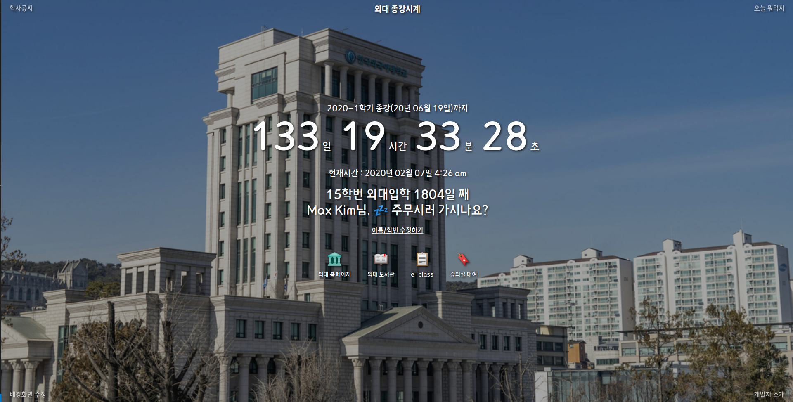

# ⏱ 외대 종강시계
<!-- [](http://hits.dwyl.com/maxkim-j/https://githubcom/MaxKim-J/HUFS-Semester-Clock-Extension) -->
HUFS-Semester-Clock-Extension  
외대생을 위한, 종강까지 얼마나 남았는지 보여주는 크롬 익스텐션  


## ✅ 주요 기능

- 새로운 탭을 생성하면 크롬의 디폴트 배경화면 대신, 익스텐션이 제공하는 배경 이미지와 기능이 제공됩니다.
- 학기 중에는 종강까지 남은 시간을 보여줍니다.
- 방학 중에는 계절학기 종강까지 or 다음학기 개강까지 남은 시간을 보여줍니다.
- 학번과 이름을 입력하면 시간에 따른 랜덤 멘트와 입학한 날짜로부터 얼마나 지났는지 볼 수 있습니다.
- 배경화면을 커스텀 할 수 있으며, 점심/저녁 메뉴 랜덤 생성기, 학사 공지 조회(추후 개발 예정)같은 시계 외의 기능도 존재합니다.

## 🛠 설치
### 개발모드
```shell
git clone https://github.com/MaxKim-J/HUFS-Semester-Clock-Extension.git
cd HUFS-Semester-Clock-Extension
npm install
npm run dev
```
### 배포(dist폴더 만들기)
```shell
npm run build
```
이후 `chrome://extension`으로 이동 후, `압축 해제된 프로젝트 로드` 버튼을 통해 생성된 `dist` 폴더를 로드하면 크롬 브라우저에 익스텐션을 적용할 수 있습니다.

## ⚓ 의존성  
- [Vue.js](https://github.com/vuejs/vue)
- [Vue-web-extension](https://github.com/Kocal/vue-web-extension)
- [Vuex](https://github.com/vuejs/vuex)
- [vue-moment](https://github.com/brockpetrie/vue-moment)

## 🚩 버전

**현재 1.0.0 버전이 구글 웹스토어의 승인을 기다리고 있습니다**

릴리즈 노트에 업데이트 될 예정입니다.

## 👨 기여
**모든 종류의 커밋을 환영합니다!**
- 관리자) [MaxKim-J](https://github.com/MaxKim-J)

## 📢 라이센스
**1.0.0 릴리즈 후 라이센스 파일을 추가할 예정입니다**

MIT
